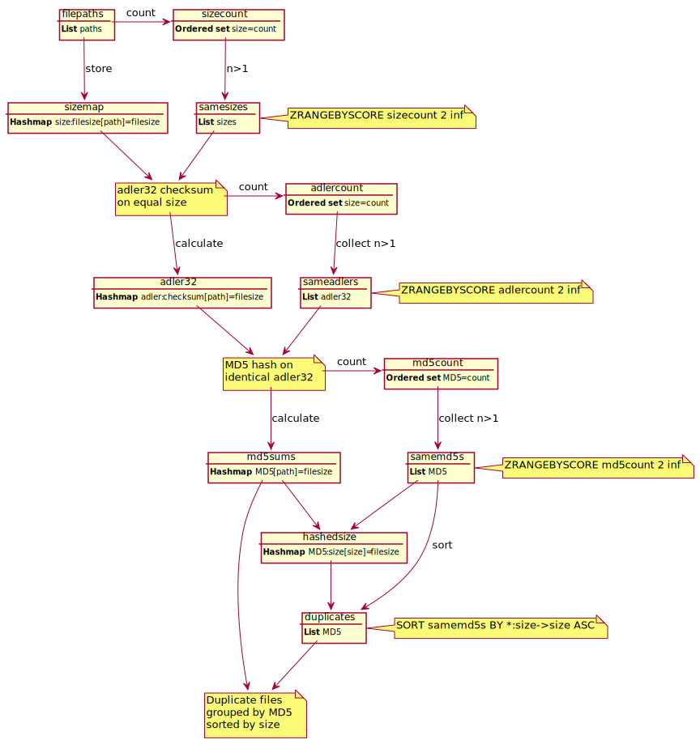

# redis-dupfilefinder.py
_by Kåre Hampf 2020_

A small utility written in Python for finding duplicate files within given paths using methods found in Redis. Tested both under plain Linux and using Python in Windows 10 with redis-server running in an Ubuntu 18.04LTS WSL (Windows Subsystem for Linux).

## Requirements
* Python3
* redis-libraries (```pip install redis```)
* A redis-server. Can be started as user without password and it will work out-of-the-box. If you need to use a password then eedit the Python-script.

## Usage
1. Start a redis server instance for example using `redis-server` on Linux or the Linux-subsystem in Windows.

2. Run `python redis-dupfilefinder.py PATH1 PATH2 ... PATHn` or without arguments to list previously found duplicate files from database. The script can also be run with executable attribute set using the hashbang-property (#!/usr/bin/python) on most systems.

### Example:

```bash
$ redis-dupfilefinder.py Fonts
Scan initiated
Recursively collecting files in "Fonts"
Collected 1699 paths in listCOAL.ttfNerd-Regular.ttflic.otfnted .ttfT.ttf4a95e26
Determining file sizes...
Progress: |██████████████████████████████████████████████████| 100.0% Complete
Based on file size, 78 groups might be duplicates
Quick comparison using adler32 checksums...
Progress: |██████████████████████████████████████████████████| 100.0% Complete
Based on adler32 checksums, 4 groups might be duplicates
Thorough comparison using MD5 hashes...
Progress: |██████████████████████████████████████████████████| 100.0% Complete
Based on MD5 checksums, 4 groups are duplicates
=== MD5:9d8a09ff3dc5abc17e09561974688dca bytes:194 ===
/quatre/Fonts/Menlo-for-Powerline/.git/logs/HEAD
/quatre/Fonts/Menlo-for-Powerline/.git/logs/refs/remotes/origin/HEAD
/quatre/Fonts/Menlo-for-Powerline/.git/logs/refs/heads/master
=== MD5:e7629d2374443b7e604c831de1fee8f1 bytes:9248 ===
/quatre/Fonts/Windows/ega40737.fon
/quatre/Fonts/Windows/ega40869.fon
=== MD5:46aaf69a91703493b666f212a04f2d8d bytes:18332 ===
/quatre/Fonts/Universalis-Std-20110904/WOFF/COPYING
/quatre/Fonts/Universalis-Std-20110904/OTF/COPYING
=== MD5:4b0f65b4f755fc1bb93f1ecf0d938cb6 bytes:41500 ===
/quatre/Fonts/Additions/Casual Contact MF.ttf
/quatre/Fonts/Decorative/CASUCM__.TTF
Invoke without parameters to print results again
```

## Datatypes used

